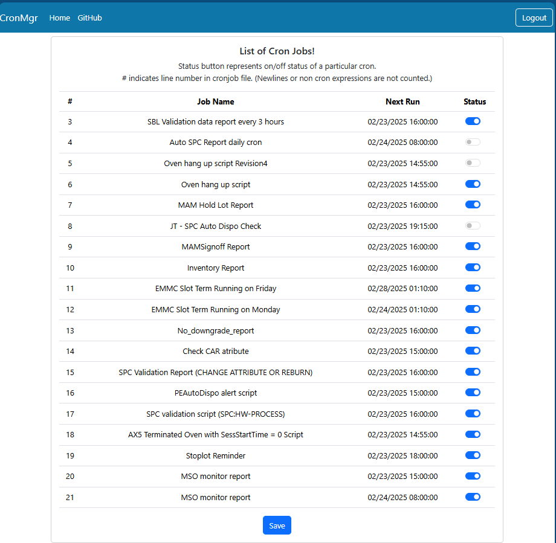
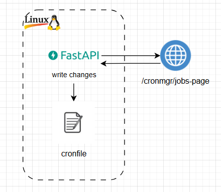

# Cron Manager
This is a simple web app to turn on/off cron job running in Linux server. This app allows non-techincal users to edit cron job easily without crontab knowledge.

## Table of Contents
- [Project Setup](#project-setup)
- [Usage](#credential)
- [Kill Server](#kill-server)
- [Project Structure](#project-structure)


## Project Setup
1. Prerequisites: python3.6, pip21.3.1

2. Create virtual env.

    ```
    python -m venv venv_linux
    ```

3. Activate virtual env.
    
    ```
    source venv_linux/bin/activate.csh
    ```

4. Install requirements.txt.

    ```
    pip install requirements.txt
    ```

5. Setup desired username and password in `./env/env`.

    ```
    CRONMGR_USER=<your_username>
    CRONMGR_PASS=<your_pwd>
    ```

6. Generate desired secrete key
    ```
    openssl rand -hex 32
    ```
    and save in `./env/env`.
    ```
    SECRET_KEY=<your_key>
    ```

7. Setup your desired location to save cronfile in `./env/env`.
    ```
    CRON_FILE=<your_file>
    ```

8. Run shell script to launch server.

    ```
    ./cronmgr.sh
    ```

## Usage
- Open `url http://<your_server>:9090` in your browser.

- Toggle buttons to turn on and off specific cronjob.

- Ensure to click save button at the end of web page to make changes. Otherwise, all changes will be lost.

- Since cronjobs are simply saved in flat file, multiple users editing at the same time might cause problem.

- Importantly, your cronjob must be saved in the following format to be rendered in webapp.
  ```
  */3 * * * * <your script or cmd> # <your script name to be appeared in web> 
  ```

    <br>
    

## Kill Server
- Server process id is stored in `server.pid` once server is launched. Simply kill it.

    ```kill <process_id>```


## Project Structure
- This is simple architecture of this project. FastAPI server hosts endpoints on Linux server and user makes changes to cronfile via web app.
    <br>
    
